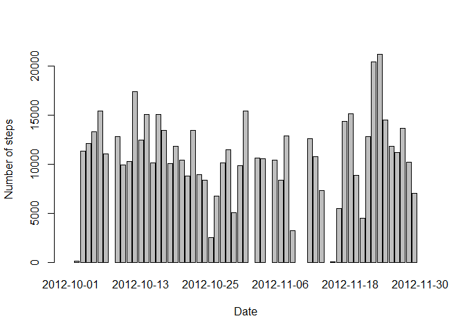
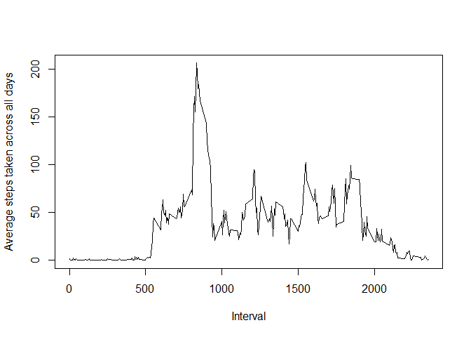
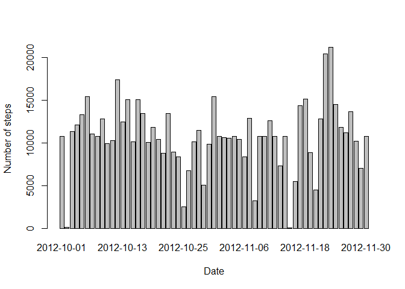

# Reproducible Research: Peer Assessment 1


## Loading and preprocessing the data

Load the data:

```r
setwd("~/workspace/repdata-006/RepData_PeerAssessment1")

mydata <- read.csv("activity.csv", stringsAsFactors = FALSE)
```

Process/transform the data (if necessary) into a format suitable for your analysis:  

```r
## Convert mydata$date from Character to Date
mydata$date <- as.Date(mydata$date, "%Y-%m-%d")
```


## What is mean total number of steps taken per day?

Make a histogram of the total number of steps taken each day:

```r
date.sum <- tapply(mydata$steps, mydata$date, sum)

barplot(date.sum,
        xlab = "Date",
        ylab = "Number of steps")
```

 

Calculate and report the mean and median total number of steps taken per day:

```r
mean(date.sum, na.rm = TRUE)
```

```
## [1] 10766
```


```r
median(date.sum, na.rm = TRUE)
```

```
## [1] 10765
```

## What is the average daily activity pattern?

Make a time series plot (i.e. type = "l") of the 5-minute interval (x-axis) and 
the average number of steps taken, averaged across all days (y-axis):

```r
## Aggregate steps by interval, and take the mean
interval.mean <- aggregate(mydata$steps ~ mydata$interval, FUN = mean)

## Give columns user-friendly names
colnames(interval.mean) <- c("interval", "steps.mean")

plot(interval.mean$steps.mean ~ interval.mean$interval,
     type = "l",
     xlab = "Interval",
     ylab = "Average steps taken across all days")
```

 

Which 5-minute interval, on average across all the days in the dataset, contains 
the maximum number of steps?

```r
interval.mean[interval.mean$steps.mean == max(interval.mean$steps.mean), "interval"]
```

```
## [1] 835
```

## Imputing missing values

Calculate and report the total number of missing values in the dataset (i.e. the 
total number of rows with NAs):

```r
nas <- is.na(mydata$steps)

sum(nas)
```

```
## [1] 2304
```

Devise a strategy for filling in all of the missing values in the dataset. The 
strategy does not need to be sophisticated. For example, you could use the mean/median 
for that day, or the mean for that 5-minute interval, etc:  
I will impute missing values from the mean of the interval.

Create a new dataset that is equal to the original dataset but with the missing data filled in:

```r
## Take subset of data where steps = NA
mydata.nas <- mydata[nas, ]

## Merge average steps by interval into missing staeps data
mydata.nas.imputed <- merge(mydata.nas, interval.mean, by = "interval", all = FALSE)

## Copy over to default steps column
mydata.nas.imputed$steps <- mydata.nas.imputed$steps.mean

## Remove extra column, now unnecessary
mydata.nas.imputed$steps.mean <- NULL

## Take subset of data with valid steps
mydata.no.nas <- mydata[!nas, ]

## Combine valid steps with imputed steps data
mydata.complete <- rbind(mydata.no.nas[, names(mydata)], mydata.nas.imputed[, names(mydata)])

## Order resulting data by date and interval
mydata.complete <- mydata.complete[order(mydata.complete$date, mydata.complete$interval), ]
```

Make a histogram of the total number of steps taken each day:

```r
date.sum.imputed <- tapply(mydata.complete$steps, mydata.complete$date, sum)

barplot(date.sum.imputed,
        xlab = "Date",
        ylab = "Number of steps")
```

 

Calculate and report the mean and median total number of steps taken per day:

```r
mean(date.sum.imputed, na.rm = TRUE)
```

```
## [1] 10766
```


```r
median(date.sum.imputed, na.rm = TRUE)
```

```
## [1] 10766
```

Do these values differ from the estimates from the first part of the assignment?  
Not significantly.

What is the impact of imputing missing data on the estimates of the total daily number of steps?  
Imputing missing data should not change the statistics of the data.

## Are there differences in activity patterns between weekdays and weekends?

Create a new factor variable in the dataset with two levels - "weekday" and "weekend" indicating whether a given date is a weekday or weekend day:

```r
mydata.complete$weekday <- as.factor(ifelse(weekdays(mydata.complete$date) %in% c("Saturday","Sunday"), "weekend", "weekday"))
```

Make a panel plot containing a time series plot (i.e. type = "l") of the 5-minute 
interval (x-axis) and the average number of steps taken, averaged across all weekday 
days or weekend days (y-axis):

```r
## Aggregate steps by interval and weekday, and take the mean
interval.mean.weekday <- aggregate(mydata.complete$steps ~ mydata.complete$interval + mydata.complete$weekday, FUN = mean)

## Give columns user-friendly names
colnames(interval.mean.weekday) <- c("interval", "weekday", "steps.mean")

## If lattice package not already installed, install it, then load it
if(!require(lattice)) {install.packages("lattice")}
```

```
## Loading required package: lattice
```

```r
require(lattice)

xyplot(steps.mean ~ interval | weekday,
       data = interval.mean.weekday,
       layout = c(1,2),
       type = "l",
       xlab = "Interval",
       ylab = "Number of steps")
```

 

